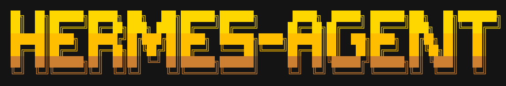

<p align="center">
  
</p>

<p align="center">
  . 
  . 
  
</p>

# PIXY TERMINAL
--

<p align="center">
  Persistent Hermes companion terminal for chat, memory, session continuity, and skill execution.
</p>

PIXY TERMINAL is a local browser shell for Hermes Agent. It is built for one thing: making a personal agent feel continuous instead of stateless.

The chat stays primary, but the runtime truth stays visible too. PIXY shows whether Hermes is live or degraded, what memory is mounted, which session is active, and which skill was invoked. If Hermes is unavailable, the app drops into explicit simulator mode instead of failing silently.

## Features

- Persistent chat: resume the latest Hermes thread and hydrate prior transcript directly into the chat window
- Memory visibility: surface memory-backed evidence in the UI and read/write `MEMORY.md` through the backend wrapper
- Session continuity: show resumed thread state, open loops, message count, and last sync context
- Actionable skills: inspect skills and run real skill actions such as `/skills run ascii-art :: ...`
- Runtime truth: expose live Hermes CLI mode, warnings, and fallback conditions without hiding degraded states
- Local-first shell: FastAPI backend + Next.js frontend, optimized for local demo reliability before deployment work
- Companion UX: terminal-styled chat shell with an agent presence panel instead of a generic chatbot layout

## Key Concepts

### Hermes Runtime

PIXY can talk to Hermes through a local CLI bridge. If Hermes is live, requests run against the real agent. If Hermes is missing or unavailable, the UI stays usable in simulator mode with explicit warnings.

### Session

A session is a Hermes conversation thread stored on disk under `~/.hermes/sessions`. PIXY can resume the latest thread, hydrate old messages back into the browser, and switch between recent sessions or start a new thread.

### Memory Ledger

Memory is sourced from `~/.hermes/memories/MEMORY.md` with fallback support for `~/.hermes/MEMORY.md`. PIXY shows memory as product evidence, not hidden prompt stuffing.

### State Trace

PIXY separates runtime state from marketing language. The interface exposes whether the agent is idle, thinking, responding, or warning, plus whether runtime, memory link, and response drafting are active.

### Skill Invocation

Skills are a first-class part of the shell. PIXY can list installed skills, inspect skill metadata, and trigger execution-oriented commands through Hermes.

## Architecture

### Backend

`server/` is a small FastAPI wrapper around Hermes storage and Hermes CLI execution.

- `/health`: runtime availability and fallback state
- `/chat`: Hermes chat bridge with memory injection and structured response metadata
- `/skills`: installed Hermes skills
- `/memory`: current memory source
- `/sessions`: recent Hermes sessions
- `/sessions/{session_id}`: transcript hydration for a specific session

### Frontend

`frontend/` is a Next.js app-router client with local proxy routes.

- `Chat`: primary companion shell
- `Dashboard`: runtime, memory, and session proof for demo use
- `Skills`: installed skill library with searchable cards

### Storage

PIXY is file-driven.

- Hermes sessions live in `~/.hermes/sessions`
- Memory lives in `~/.hermes/memories/MEMORY.md`
- Skills are resolved from Hermes CLI and Hermes skill sources

## Quick Start

Prerequisites:

- Python 3.10+
- Node.js 20+
- Hermes CLI installed and authenticated if you want live runtime

Clone and run:

```bash
git clone https://github.com/starlash7/PIXY-Terminal.git
cd PIXY-Terminal
```

### 1. Backend

```bash
cd server
python3 -m venv .venv
source .venv/bin/activate
pip install -r requirements.txt
uvicorn app.main:app --reload --host 127.0.0.1 --port 8000
```

Optional environment variables:

- `PIXY_HERMES_HOME` or `HERMES_HOME`: override Hermes storage path
- `PIXY_FRONTEND_ORIGIN`: allowed frontend origin for CORS

### 2. Frontend

```bash
cd frontend
npm install
npm run dev -- --hostname 127.0.0.1 --port 3000
```

Optional environment variable:

- `PIXY_BACKEND_URL`: defaults to `http://127.0.0.1:8000`

Open `http://127.0.0.1:3000`.

If Hermes is not available yet, PIXY still boots in simulator mode so the UI and demo flow remain usable.

## Demo Flow

Recommended local demo sequence:

1. Open `Chat` and show that the thread resumes instead of starting from nothing
2. Ask a follow-up question that depends on prior context
3. Point out the memory evidence chips and continuity strip
4. Run a real skill command such as `/skills run ascii-art :: Draw a tiny cat in ASCII using 6 lines or fewer.`
5. Open `Dashboard` or `Skills` only after the main chat experience lands

The strongest framing is:

> PIXY is a persistent Hermes companion terminal that remembers, resumes, and acts.

## Project Structure

```text
frontend/
  app/                 Next.js app router pages and API proxy routes
  components/          Chat shell, dashboard, skills, presence UI
  lib/                 Types, API client helpers, derived UI insights

server/
  app/main.py          FastAPI wrapper around Hermes runtime and disk state

design/
  pencil/              UI prompt docs and design notes
  assets/              README assets such as the PIXY logo

plan.md                MVP scope, guardrails, and visual direction
```

## Validation

Run these after setup:

```bash
cd server && source .venv/bin/activate && python -m compileall app
cd frontend && npm run lint
cd frontend && npm run build
```

Useful health checks:

```bash
curl http://127.0.0.1:8000/health
curl http://127.0.0.1:3000/api/health
```

## Roadmap

### Current Focus

- Make memory, continuity, and action visible in one chat screen
- Keep local Hermes runtime stable for demo use
- Improve the companion feel without hiding runtime truth

### Next

- Stronger session switching and curated demo threads
- Better skill execution demos beyond inspect/list flows
- Cleaner presentation mode for hackathon recording

### Not in Scope for This Cut

- Slack or Telegram delivery
- Heavy avatar systems such as Live2D, Spine, or full 3D character pipelines
- Scheduler UI and extra analytics dashboards
- Deployment-first work that hurts local demo reliability
